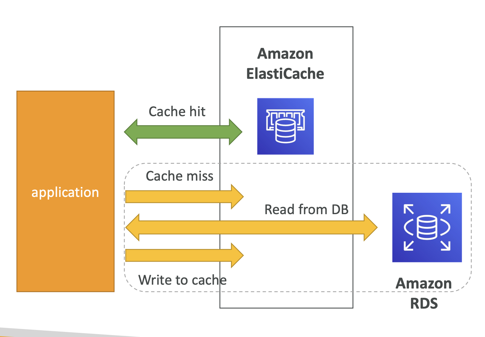
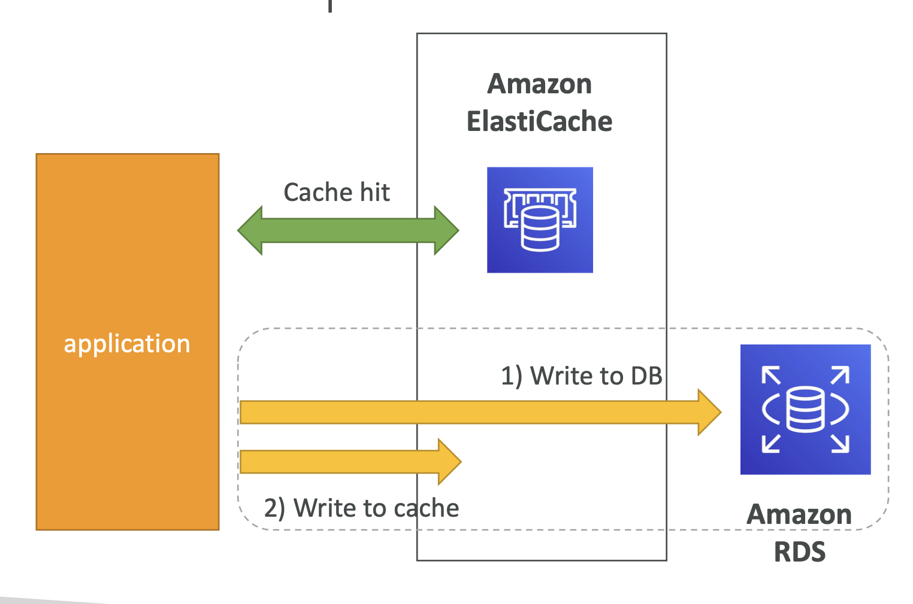

# Section 8. RDS + Aurora + ElastiCache

## RDS (Relational Database Service)

- **Managed database service** for DBs like MySQL, PostgreSQL, Oracle, SQL Server, etc.
- **Automated backups**, **software patching**, **scaling**, **replication**, etc.
- **Storage Auto-scaling**: Automatically scales storage capacity.

## RDS Read Replicas for Read Scalability

- Read-only copies of the master DB.
- **Asynchronous replication**: Data is copied from the master DB to the read replicas.
- Free for same region / charged for cross-region.
- Different from Multi-AZ (Disaster Recovery).
  - Multi-AZ: Synchronous replication for failover.
  - Read Replicas: Asynchronous replication for read scalability.
    

## Aurora

- **MySQL** and **PostgreSQL**-compatible.
- **5x performance** of MySQL, 3x of PostgreSQL.
- **Automatic failover** and **high availability** and **read scaling**.
- 1 primary instance and 15 read replicas.
- Cross-region replication.

## RDS & Aurora Security

- **At-rest encryption**: Encrypts data using KMS.
- **Inflight encryption**: SSL certificates to encrypt data to and from the DB.
- **IAM Authentication**: Authenticate using IAM user / role.
- **Security Groups**: Control inbound and outbound traffic to the DB.
- **No SSH access** to the DB.

## RDS Proxy

- To pool and share DB connections established with the database.
- Improve database efficiency by reducing database load.
- Serverless, auto-scaling, and highly available.
- Enforce IAM Authentication for DB connections and securely store credentials in Secrets Manager.
- RDS Proxy is only accessible within the VPC.
  

## ElastiCache

- **In-memory caching** service: Redis or Memcached.
- **Improves latency** and **throughput** for read-heavy applications.
- Can be used for user session store, database cache, etc.
- Redis vs Memcached:
  - **Redis**: Multi-AZ, Read Replicas, Backup and Restore, Data Persistence.
  - **Memcached**: Multi-node for partitioning large data, non-persistent.

## ElastiCache Strategies

- **Lazy Loading**: Cache miss -> fetch from DB -> store in cache.
  - **Pros**: Only cache what's needed.
  - **Cons**: Cache miss penalty. (Has to fetch from DB), stale data (if DB is updated).
    
- **Write Through**: Write to cache and DB.
  - **Pros**: Data in cache is never stale.
  - **Cons**: Write penalty. (Has to write to DB), Cache churn (data not read is evicted).
    
- Cache Eviction and Time-to-Live (TTL)
  - **TTL**: Time-to-Live for cache data.
  - **LRU**: Least Recently Used for cache eviction.
  - **LFU**: Least Frequently Used for cache eviction.

## TODO:

- At-rest encryption: Encrypts data using KMS. -> 디비 자체에 암호화된 데이터를 저장하는 것인지?
